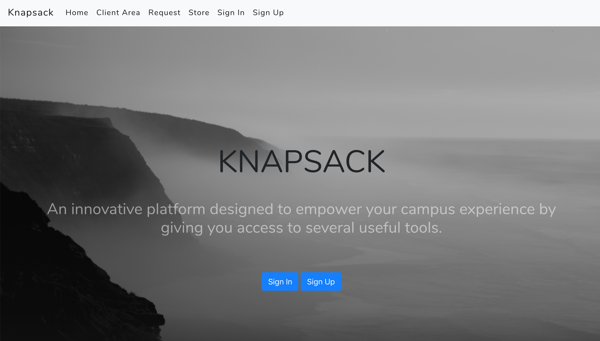

# HOBOS
## knapsack

### Semester
Fall 2018

### Overview
Knapsack is a platform that provides college students modular applications that will improve their campus experience, called "knapsack tools". As more tools get developed, knapsack users will be able to add more knapsack tools to their collection, i.e. their knapsack. Knapsack users will also be able to submit suggestions for new knapsack tools which the community can then vote on.

### Team Members
* Jingshu Meng, jingshumeng
* Zhihan Ying, EveYing
* Conan Chen, Conan Chen
* William He, GithubdeWill 
* Jacob Goldman, JacobGo

### User Interface
* Home: Main Page with an explanation of knapsack with button to sign up / login. 

* Library/Store: Displays the user’s collection (knapsack) of tools and a store area that allows the user to add more tools

* Request: Place to request new components and vote for ideas

* Map: Interface to access tools geographically placed around campus

* Signup / login: Pages to facilitate registration and logging in

### Data Model

* Knapsack: container for tools
* User: account used to login, owns one knapsack
* Tool: individual component that provides functionality for campus stuff
* ToolRequest: request for new tool
* ToolVotes: votes for tool requests

### URL Routes/Mapping

* `/` : Home page
* `map/`: View of campus map with links to components
* `library/`: Displays the user’s collection (knapsack) of tools and a store area that allows the user to add more tools (user must be authenticated)
* `example/`: An example knapsack tool
* `request/`: Place to request new components and vote for ideas 
* `request/vote/<int:request_id>`: Backend route to register vote; error if not logged in
* `request/new`: Backend route to make a new request; error if not logged in
* `request/remove/<int:request_id>`: Backend route to remove a request; error if not owner
* `signup/`: Page for signing up for an account
* `accounts/login/` Page for logging into your account 

### Authentication/Authorization
We use authentication for most of the site, providing empty guest views when unauthenticated. It is used to login, fetch the correct user’s knapsack, associate a tool request with a user, register a vote from a user, and select tools on map.

### Team Choice
Our team choice is unique in that we get to encapsulate entire applications within each tool. We’d like to flesh out a single component to develop a sense of how powerful this platform truly can be. 

### Conclusion
We as a team have come to learn so much about the website that power our day to day lives. It was quite insightful seeing how a request moves from browser to server, the difference between frontend and backend, and the different technologies used on the web. We struggled at times with creating a uniform style both visually on the frontend and programmatically on the backend. Together we learned so much and we are proud of the product we created.